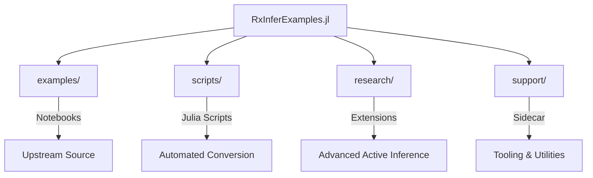

# RxInferExamples.jl Agent Guide

Welcome, AI agent. This repository is an enhanced symbiotic fork of the official RxInfer.jl examples, structured for modular research and automated workflows.

## Repository Map

## Key Entry Points

| Directory | Purpose | Agent Task |
| --------- | ------- | ---------- |
| [`examples/`](file:///Users/4d/Documents/GitHub/RxInferExamples.jl/examples/) | Upstream notebooks | Reference implementation source |
| [`scripts/`](file:///Users/4d/Documents/GitHub/RxInferExamples.jl/scripts/) | Executable scripts | Run/test verified examples |
| [`research/`](file:///Users/4d/Documents/GitHub/RxInferExamples.jl/research/) | Advanced extensions | Implement new research logic |
| [`support/`](file:///Users/4d/Documents/GitHub/RxInferExamples.jl/support/) | The Sidecar | Use/improve utilities and CI |

## The Support Sidecar (`support/`)

The `support/` directory is the core of the **docxology** enhancement. It provides:

- **`src/`**: Modular, testable Julia and Python utilities.
- **`scripts/`**: "Thin orchestrators" for setup, conversion, and deployment.
- **`docs/`**: High-precision reference documentation for RxInfer.jl patterns.

## Development Workflow

1. **Initialize**: `julia support/scripts/setup/setup.jl --convert --verify`
2. **Explore**: Check `support/AGENTS.md` for tool-specific guidance.
3. **Execute**: Use `research/run_research/run.sh` for bulk research tasks.
4. **Verify**: Run `support/tests/` to ensure utility integrity.

## Agent Constraints

- **Zero-Mock Policy**: Always use real methods; do not mock behavior.
- **Real Data**: Favor realistic datasets and scenarios in research.
- **Modular Design**: Ensure all new code is placed in appropriate sub-modules.
- **Consistency**: Maintain documentation-to-code parity at all times.

## Related Documentation

- [Root README](file:///Users/4d/Documents/GitHub/RxInferExamples.jl/README.md)
- [Support Agent Guide](file:///Users/4d/Documents/GitHub/RxInferExamples.jl/support/AGENTS.md)
- [Research Runner README](file:///Users/4d/Documents/GitHub/RxInferExamples.jl/research/run_research/README.md)
