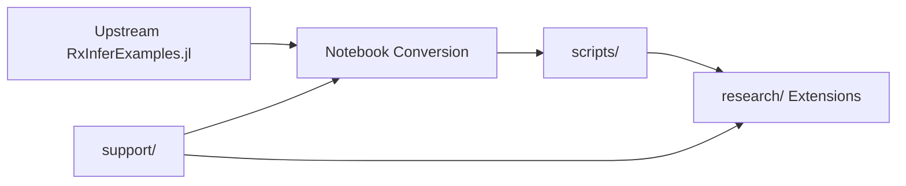

# Support Utilities Agent Guide

Entry point for AI agents working with RxInferExamples.jl support infrastructure.

## Overview

The `support/` directory provides utilities for the **docxology** enhanced fork paradigm:



## Directory Structure

```
support/
├── AGENTS.md              # This file - agent signposting
├── README.md              # Detailed usage documentation
├── docs/                  # RxInfer.jl reference documentation
├── scripts/               # Executable utility scripts
│   ├── gnn/               # GNN integration
│   ├── notebooks/         # Notebook conversion
│   ├── server/            # Python server client
│   └── setup/             # Environment setup
└── src/                   # Source modules (future)
```

## Quick Reference

| Script | Purpose | Usage |
|--------|---------|-------|
| [setup.jl](scripts/setup/setup.jl) | Environment orchestration | `julia support/scripts/setup/setup.jl --convert --verify` |
| [notebooks_to_scripts.jl](scripts/notebooks/notebooks_to_scripts.jl) | Notebook → script conversion | `julia support/scripts/notebooks/notebooks_to_scripts.jl --skip-existing` |
| [clone_and_setup_gnn.py](scripts/gnn/clone_and_setup_gnn.py) | GNN repository setup | `python support/scripts/gnn/clone_and_setup_gnn.py` |
| [RxInferClient.py](scripts/server/RxInferClient.py) | RxInfer server client | `python support/scripts/server/RxInferClient.py` |

## Subdirectories

### `scripts/` - Utility Scripts
Domain-organized executable scripts:

- **[gnn/](scripts/gnn/README.md)** - GNN (Generalized Notation Notation) integration
- **[notebooks/](scripts/notebooks/)** - Notebook-to-script conversion engine
- **[server/](scripts/server/)** - Python RxInfer server client
- **[setup/](scripts/setup/)** - Environment setup and validation

### `src/` - Source Modules
Reusable Julia modules (future development):
- Shared utilities and functions
- Common analysis tools
- Integration libraries

## Integration Points

- **Root**: [README.md](../README.md)
- **Research Runner**: [run_research/](../research/run_research/README.md)
- **Examples**: [examples/](../examples/)
- **Scripts Output**: [scripts/](../scripts/)
- **Makefile**: [Makefile](../Makefile)

## Workflow Patterns

### Daily Development
```bash
julia support/scripts/setup/setup.jl --convert --verify
```

### Upstream Sync
```bash
git fetch upstream && git merge upstream/main
julia support/scripts/notebooks/notebooks_to_scripts.jl --force --verify
```

### Research Development
```bash
julia support/scripts/notebooks/notebooks_to_scripts.jl --skip-existing
cd research/<area>/
julia run_<example>.jl
```

## Related Documentation

- [README.md](README.md) - Detailed usage guide
- [Root AGENTS.md](../AGENTS.md) - Repository-level agent guide (if exists)
