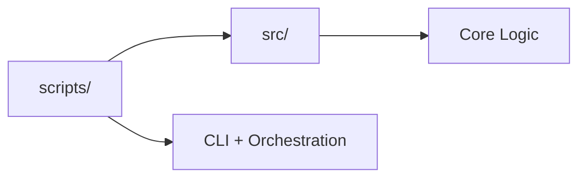

# RxInferExamples.jl Support Utilities

Enhanced fork utilities for environment management, workflow automation, and research development.

## Quick Start

```bash
# Full setup with notebook conversion
julia support/scripts/setup/setup.jl --convert --verify

# Convert notebooks only
julia support/scripts/notebooks/notebooks_to_scripts.jl --skip-existing
```

## Structure

```
support/
├── AGENTS.md           # Agent signposting
├── README.md           # This file
├── scripts/            # Thin orchestrators (CLI, workflow)
│   ├── gnn/            # → uses src/gnn_utils.py
│   ├── notebooks/      # → uses src/NotebookConversion.jl
│   ├── server/         # → uses src/server_utils.py
│   └── setup/          # → uses src/CommandUtils.jl, EnvironmentSetup.jl
└── src/                # Core modules (testable, reusable)
    ├── NotebookConversion.jl
    ├── CommandUtils.jl
    ├── EnvironmentSetup.jl
    ├── gnn_utils.py
    └── server_utils.py
```

## Core Features

| Feature | Script | Module |
|---------|--------|--------|
| **Environment Setup** | [setup.jl](scripts/setup/setup.jl) | `CommandUtils`, `EnvironmentSetup` |
| **Notebook Conversion** | [notebooks_to_scripts.jl](scripts/notebooks/notebooks_to_scripts.jl) | `NotebookConversion` |
| **GNN Integration** | [clone_and_setup_gnn.py](scripts/gnn/clone_and_setup_gnn.py) | `gnn_utils` |
| **Server Client** | [RxInferClient.py](scripts/server/RxInferClient.py) | `server_utils` |

## Workflow



1. **Setup**: Initialize environment with `setup.jl`
2. **Convert**: Transform notebooks to scripts
3. **Develop**: Work with scripts in `scripts/`
4. **Extend**: Create research extensions in `research/`

## Key Commands

### Environment Setup
```bash
julia support/scripts/setup/setup.jl --convert --verify --clean
```

### Notebook Conversion
```bash
# Incremental
julia support/scripts/notebooks/notebooks_to_scripts.jl --skip-existing

# Force all
julia support/scripts/notebooks/notebooks_to_scripts.jl --force --verify

# Filter specific
julia support/scripts/notebooks/notebooks_to_scripts.jl --filter "Kalman"
```

### Upstream Sync
```bash
git remote add upstream https://github.com/ReactiveBayes/RxInferExamples.jl.git
git fetch upstream
git merge upstream/main
julia support/scripts/notebooks/notebooks_to_scripts.jl --force --verify
```

## Documentation Hierarchy

- [Root README](../README.md) - Repository overview
- [AGENTS.md](AGENTS.md) - Agent signposting
- [scripts/README.md](scripts/README.md) - Scripts overview
- Individual script READMEs in each subdirectory

## Resources

- [RxInfer.jl Documentation](https://docs.rxinfer.com)
- [RxInfer Examples](https://examples.rxinfer.com)
- [Contribution Guide](https://examples.rxinfer.com/how_to_contribute/)
